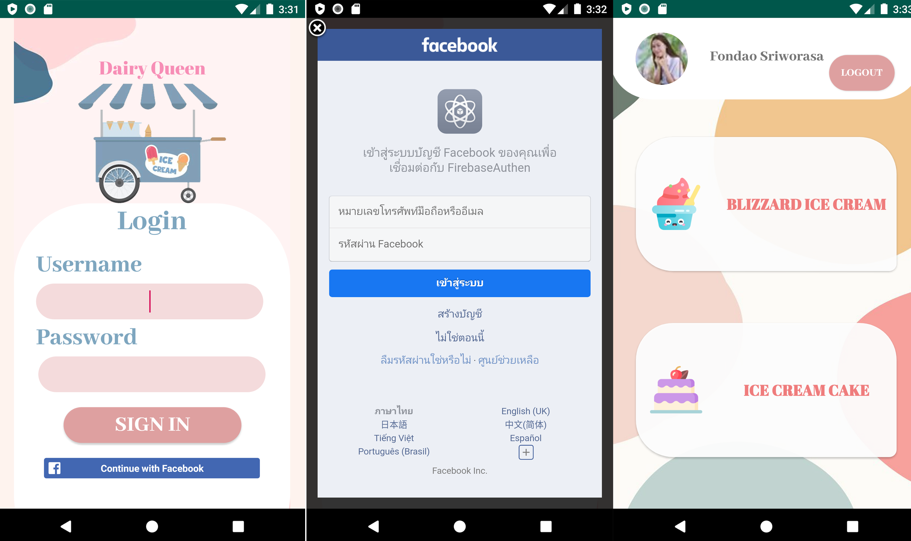

## ระบบ Dairy queen online
### 1.	Introduction

   >เนื่องจากปัจจุบันมีแอพพลิเคชันสั่งสินค้าออนไลน์เป็นจำนวนมากทำให้เกิดความอำนวยสะดวกในการใช้ชีวิตประจำวัน พร้อมทั้งยังช่วยลดปัญหาของโรค Covid 19 เพราะไม่ต้องเดินทางออกไปซื้อสินค้าด้วยตนเอง ทำให้ลดอัตราการแพร่กระจายเชื้อได้
 
   >ดังนั้นผู้จัดทำจึงได้คิดริเริ่มที่จะพัฒนาแอพพลิเคชั่นระบบ Dairy queen online ขึ้นมา เนื่องจากมีความสนใจในเรื่องของแอพพลิเคชันสั่งซื้อสินค้าออนไลน์ และมีความชื่นชอบไอศครีมแบรนด์ Dairy queen 
   
### 2. องค์ประกอบที่ในการพัฒนาแอปพลิเคชัน
       2.1 Fragment view
       2.2 Login Facebook Authen
       2.3 Recycler view
       2.4 Realtime database (show)
       2.5 Dialog alert

### 3. หน้าจอผลลัพธ์ ของแอปพลิเคชัน
       3.1 หน้าจอ login , facebook firebase authentication
  
  
  
       3.2 ส่วนของรายการ โดยแสดงข้อมูลจาก firebase Realtime database กับ Recycler view ของ Blizzard Ice Cream 
  

       3.3 ส่วนของ dialog confirm logout ของ Blizzard Ice Cream 
   
   
       3.4 ส่วนของรายการ โดยแสดงข้อมูลจาก firebase Realtime database กับ Recycler view ของ Cake ice cream
  
  
       3.5 ส่วนของ dialog confirm logout ของ Cake ice cream
   
   
   
   
